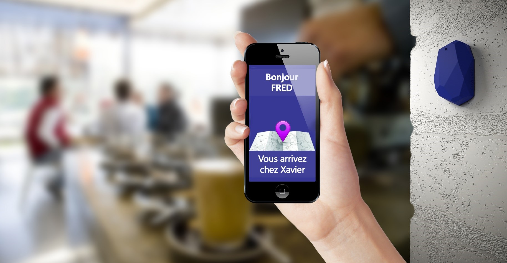

 
 
# Project Title 
 
PepperMap  
 
## Getting Started 
 
Envie de tester les ChatBots et pourquoi pas la reconnaissance vocale dans le domaine hospitalier ? 
 
Qui ne s’est jamais perdu dans le dédale des routes d’un hôpital ? Le CHR Citadelle de Liège est bien conscient du problème et souhaite le résoudre d’une manière innovante : mettre à la disposition des visiteurs des tables tactiles placées aux endroits stratégiques. Celles-ci dialogueront avec les personnes pour les guider au mieux dans l’hôpital en leur donnant des indications simples et personnalisées. Vous devrez donc recourir à des services de reconnaissance vocale ainsi qu’à une logique conversationnelle (chatbot, LUIS) connectée à la base de données des routes de l’institution.  En septembre, le projet servira d’intelligence pour le robot Pepper qui sera installé à l’accueil du CHR. 
 
### Technologies 
 
Chatbots, intelligence de langage, cognitives services  
 
### Matériel mis à disposition 
 
Tablette tactile 
 
## Authors 
 
* **Adrien Clerbois** - ** - [AClerbois](https://github.com/aclerbois) 
* **Denis Voituron** - ** - [dvoituron](https://github.com/dvoituron) 
* **Michael Fiorito** - ** - [mfiorito](https://github.com/mfiorito) 
* **Renaud Dumont** - ** - [MrRenaud](https://github.com/MrRenaud) 
 
## License 
 
This project is licensed under the MIT License - see the [LICENSE.md](LICENSE.md) file for details 

## Résultat 

