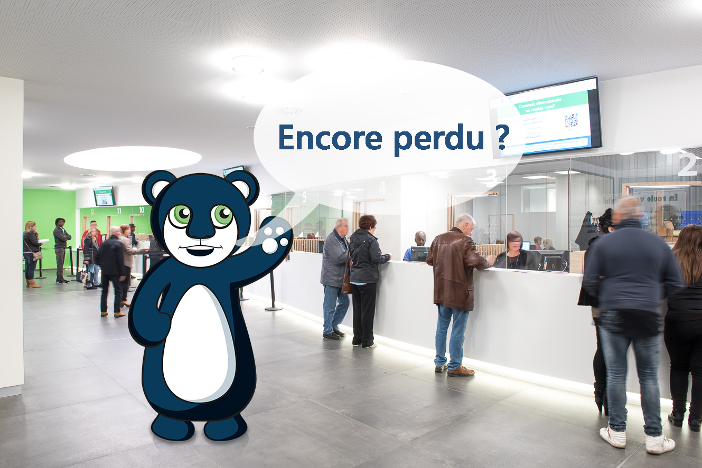
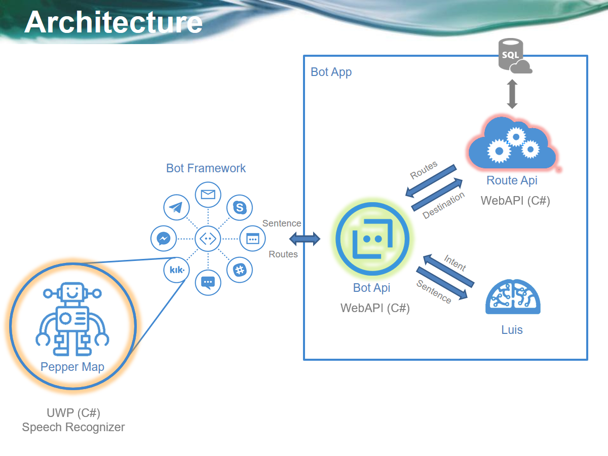
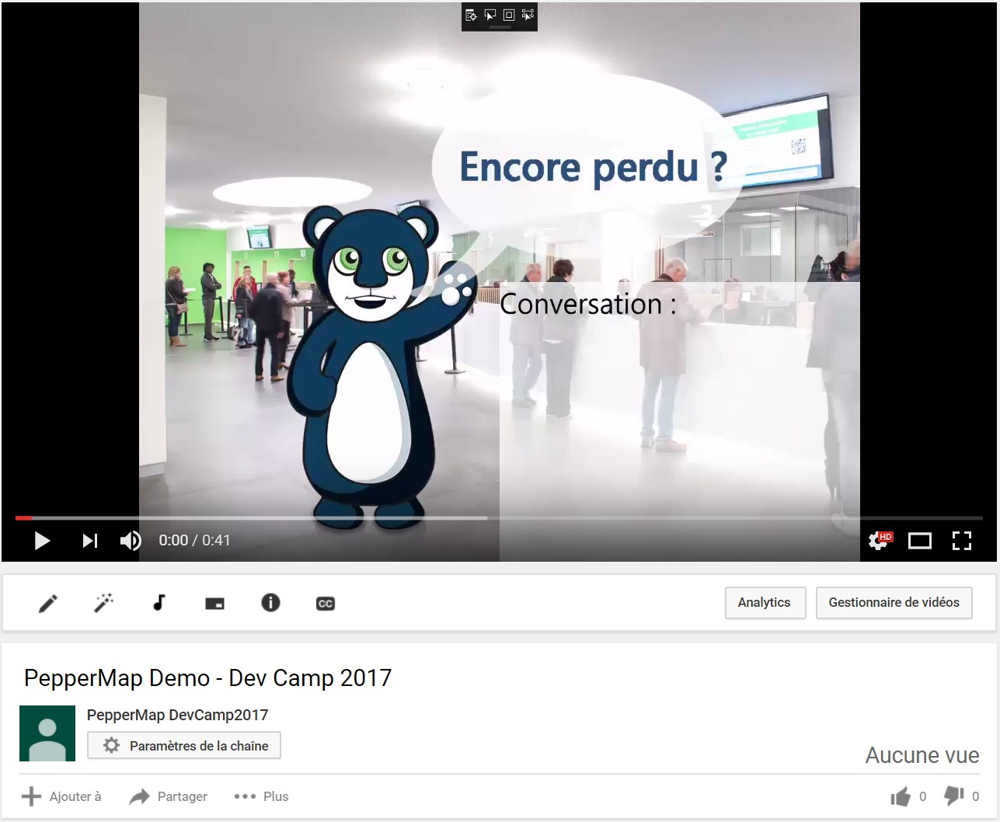

 
 
# Project Title 
 
PepperMap  
 
## Getting Started 
 
Envie de tester les ChatBots et pourquoi pas la reconnaissance vocale dans le domaine hospitalier ? 
 
Qui ne s’est jamais perdu dans le dédale des routes d’un hôpital ? Le CHR Citadelle de Liège est bien conscient du problème et souhaite le résoudre d’une manière innovante : mettre à la disposition des visiteurs des tables tactiles placées aux endroits stratégiques. Celles-ci dialogueront avec les personnes pour les guider au mieux dans l’hôpital en leur donnant des indications simples et personnalisées. Vous devrez donc recourir à des services de reconnaissance vocale ainsi qu’à une logique conversationnelle (chatbot, LUIS) connectée à la base de données des routes de l’institution.  En septembre, le projet servira d’intelligence pour le robot Pepper qui sera installé à l’accueil du CHR. 
 
### Technologies 
 
Chatbots, intelligence de langage, cognitives services  

Vu l'absence de Pepper durant le weekend, une application UWP a été développeée pour montrer l'utilisation de la reconnaissance vocale. Cette app n'est qu'une interface possible pour utiliser le service. Ce service est également accessible via d'autres canaux, tels que Messenger, Skype, ...

La reconnaissance vocale n'est pas très fiable, et il serait intéressant de tester l'utilisation d'un service cloud tel que [CRIS](https://cris.ai/). 

### Démo 

Cliquez sur l'image pour voir la vidéo de démonstration de l'application.
La vidéo est également disponible dans les [assets](assets).

 
### Matériel mis à disposition 
 
Tablette tactile 
 
## Authors 
 
* **Adrien Clerbois** - ** - [AClerbois](https://github.com/aclerbois) 
* **Denis Voituron** - ** - [dvoituron](https://github.com/dvoituron) 
* **Michael Fiorito** - ** - [mfiorito](https://github.com/mfiorito) 
* **Renaud Dumont** - ** - [MrRenaud](https://github.com/MrRenaud) 
 
## License 
 
This project is licensed under the MIT License - see the [LICENSE.md](LICENSE.md) file for details 
